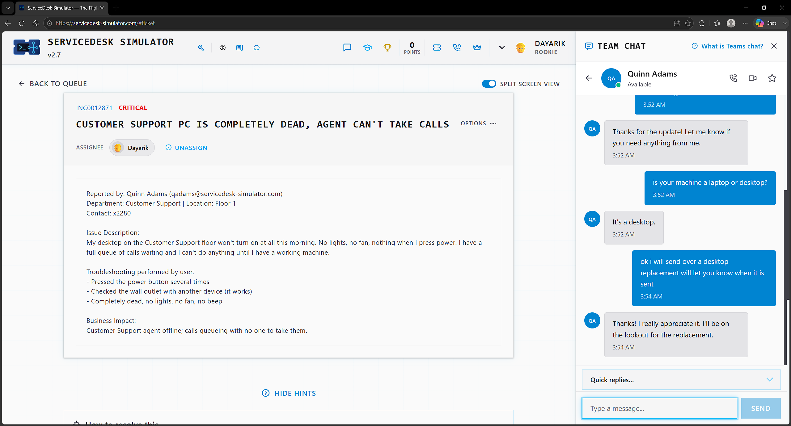

# Ticket 01 — Customer Support PC Is Completely Dead, Agent Can't Take Calls

**Incident:** INC0012871
**Priority:** Critical
**Reported by:** Quinn Adams — Customer Support, Floor 1

---

## Overview

I got a ticket where a user says the PC is completely dead and read that the user already tried to press the button several times, checked the wall outlet to see if it was providing power, which it was, and saw that there is no beep, no fans or lights turning on when pressing the button, which are all signs of PC being dead.

---

## Investigation

Before I would even think about replacing the desktop, I would ask the user to check whether the cable is firmly connected to the back of the PC and that the switch at the back of the PC where the power supply would be is on, as that can be off sometimes by accident. However, I would not spend any more time than that, as the ticket was set to critical and I have to think about business needs and the impact it will bring if not resolved. I read that with this PC being down, calls are in the queue with no one to take them, and the customer support agent is offline, making this a critical prioritization ticket.

---

## Resolution

After confirming that the PC is on and the power cable is firmly connected, I would ask the user whether it is a desktop or laptop to confirm the device, then start the process of deploying a new desktop and imaging it with the server image. I would boot up the new desktop after completing the physical setup and do a PXE network boot, so the desktop would simply have all the configuration ready with the image. After the setup, I would log in and verify it is deployed. I would then ship it to the user, ask for the address, and include a return label so the IT department can receive the user's old desktop for investigation.

---

## Verification

Then I would verify that the user has the new desktop and that there were no issues. In the asset management system, I would verify that the user has the newly deployed desktop, remove the old one assigned to him, and mark it as broken or damaged.

---

## Skills Demonstrated

- Hardware Troubleshooting
- Incident Prioritization
- End User Communication
- Workstation Deployment
- PXE Imaging
- Asset Management
- Hardware Shipping and Returns

## Technologies Used

- ServiceDesk Simulator
- Documentation Station
- Computer Deployment
- PXE Network Boot
- Server Imaging
- Ship Manager
- Asset Management
- Team Chat