# Ticket 02 — Cannot Get to My Files on the Shared Drive Anymore

**Incident:** INC0012847
**Priority:** High
**Reported by:** Sarah Mitchell — Marketing, Remote (Working from home)

---

## Overview

The user has trouble accessing a file from the shared drive and sees a message saying “The network path was not found” when attempting to open the file the user wanted to access. The user then restarted the computer and said the internet and email work fine.

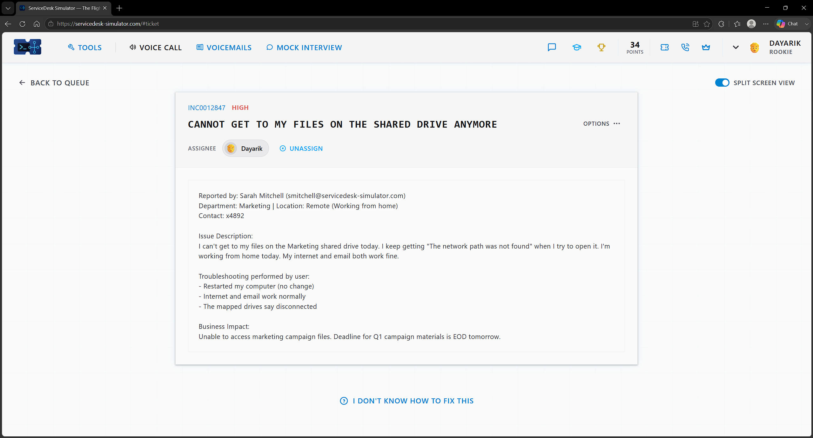

---

## Investigation

I reassured the user that I was working on it and needed to gather information before remotely accessing the user's computer. I went to the Knowledge Base to find out all of the map drives location to ensure I know how to connect the user to the correct shared files. Once I did that, I ensure to had all the information needed  before implementing the resolution and I then went to access the user device remotely using Remote Desktop Protocol. Once I accessed the user device, I checked if the connection is working and if the VPN is on before moving on.

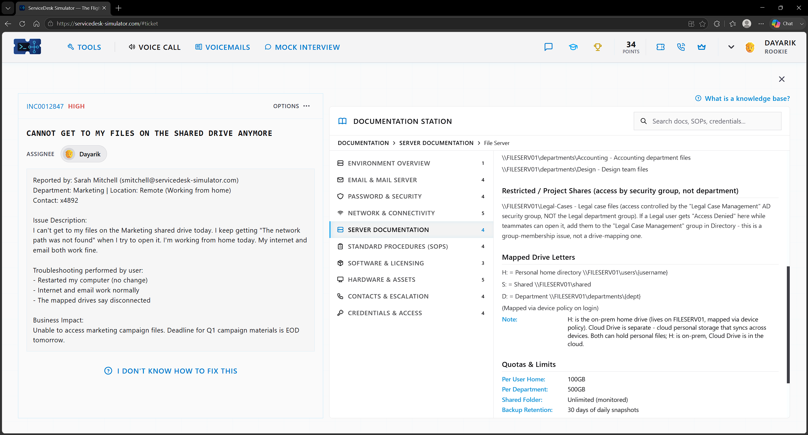

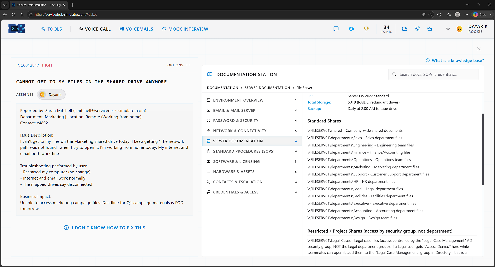

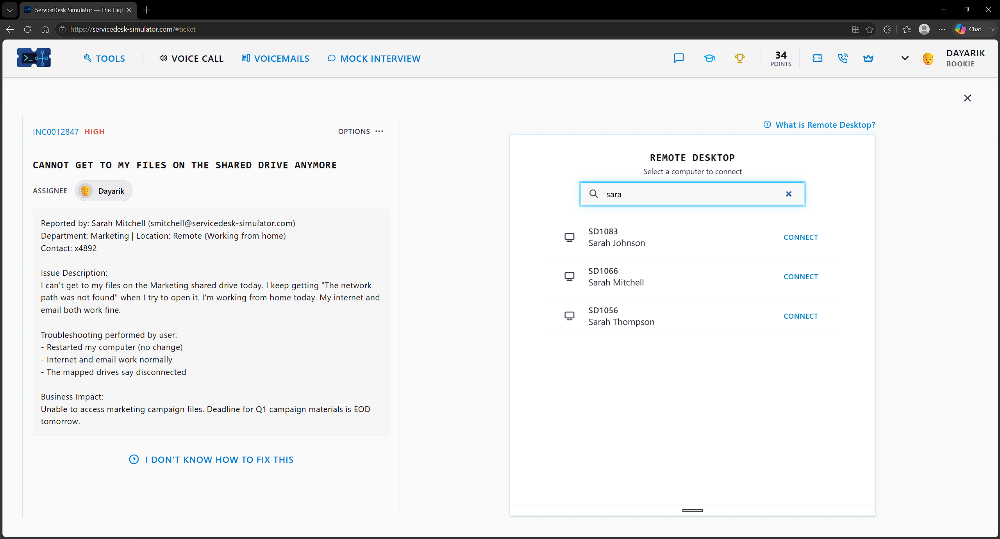

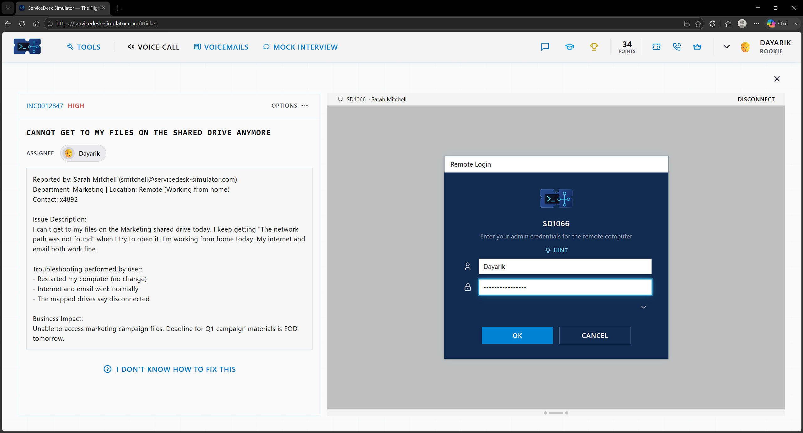

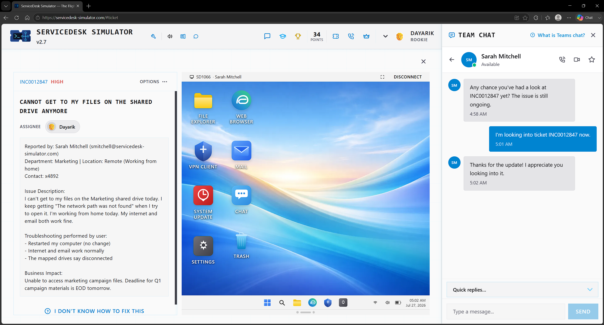

---

## Resolution

Since the user was working from home and couldn't access company resources, the first thing I checked was the VPN Client; I found it was disconnected and reconnected it, as the user needed it to access the company network. After that, I went into the user's File Explorer and saw that the network drive wasn't mapped to the user's computer, so I entered the path for the specific department the user needs, which is Marketing in this instance.

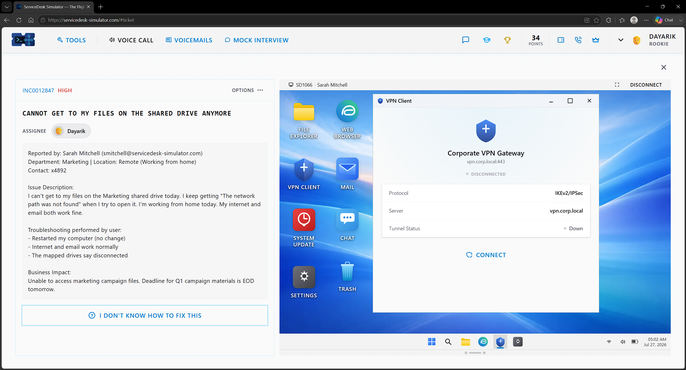

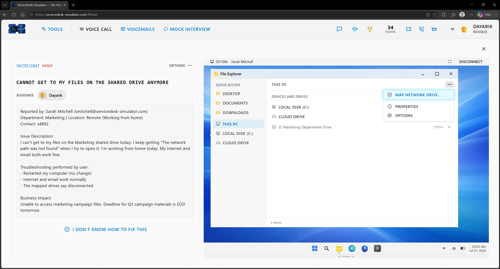

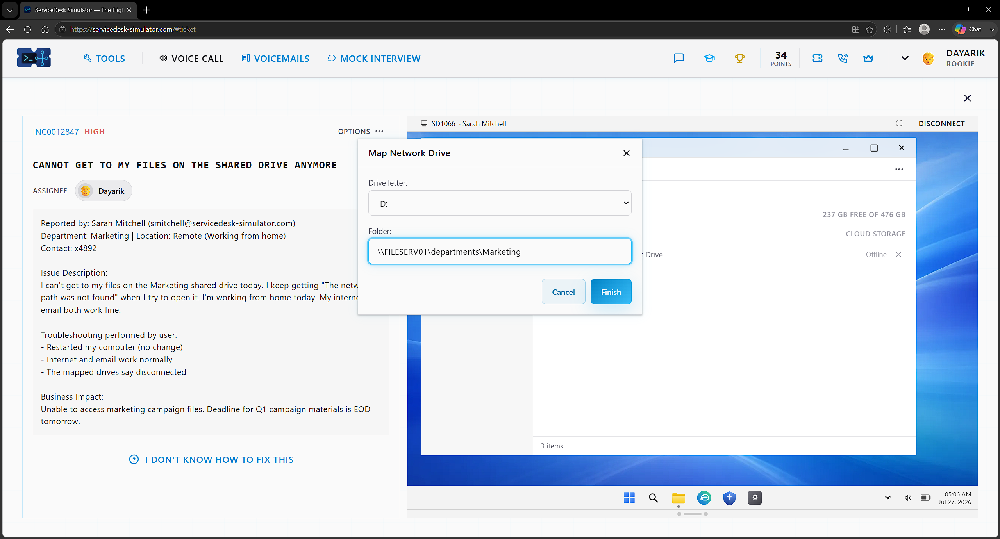

---

## Verification

After doing that, the network drive was mapped, and I verified that the user can access the files in question and the rest of the shared files. I then told the user the issue was fixed, and the user verified that it was and that it is working now.

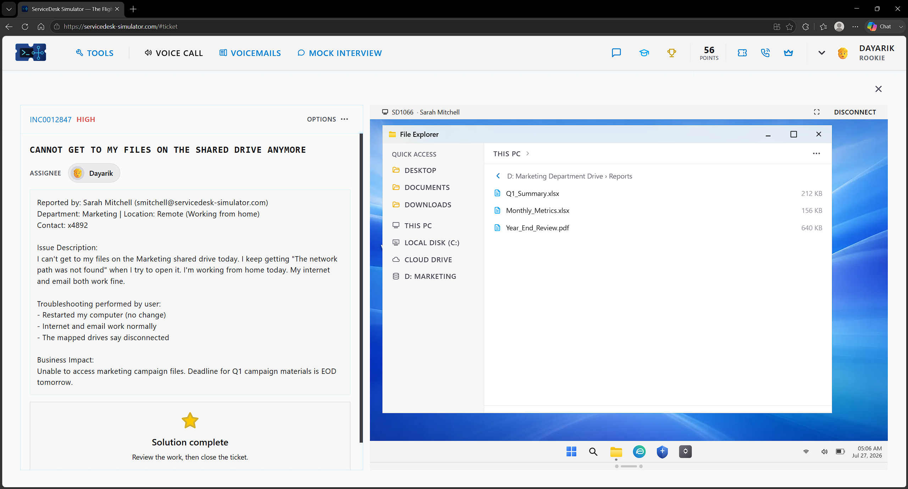

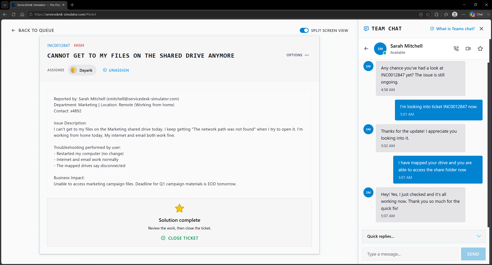

---

## Skills Demonstrated

- Remote Desktop Support
- VPN Troubleshooting
- Network Drive Mapping
- File Share Access Troubleshooting
- End User Communication

## Technologies Used

- ServiceDesk Simulator
- Documentation Station
- Remote Desktop
- VPN Client
- File Explorer
- Map Network Drive
- File Server
- Team Chat
