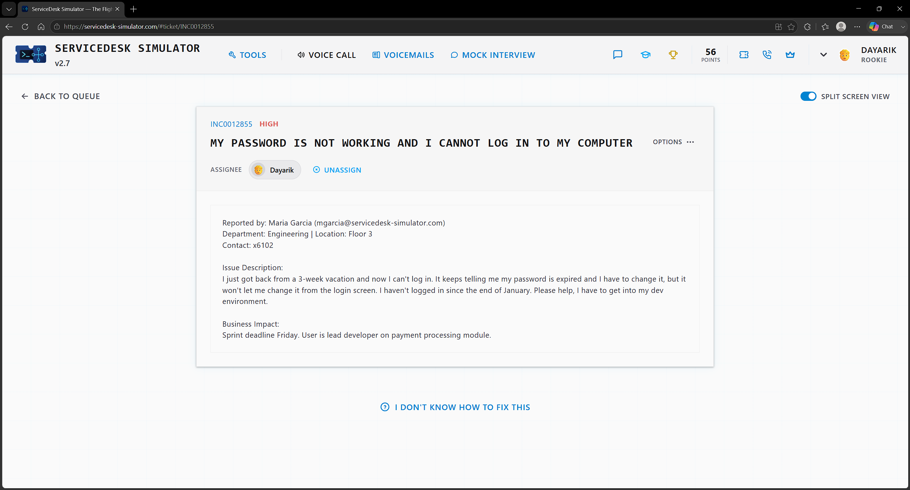
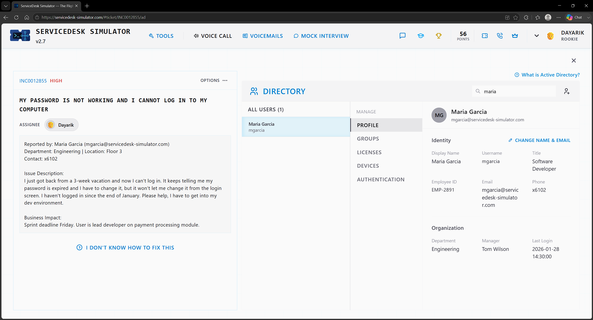
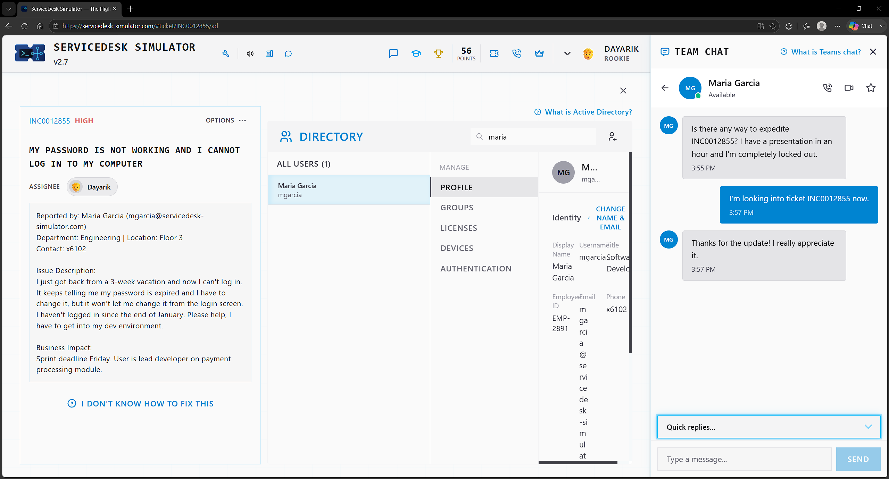
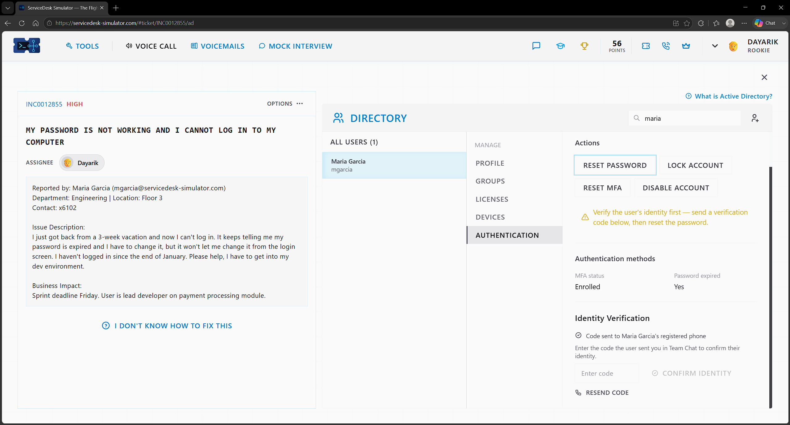
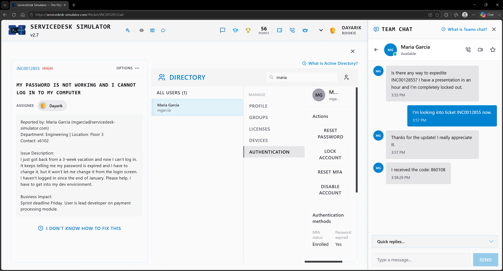
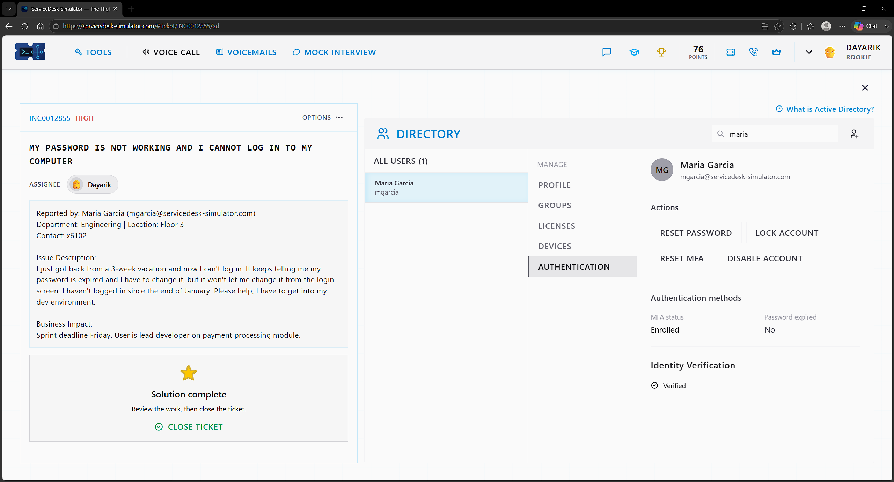
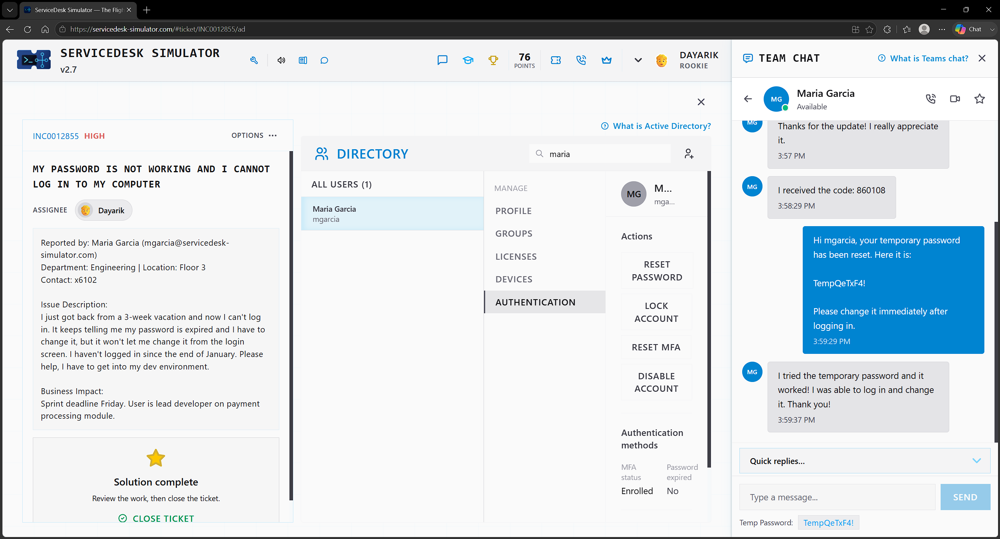

# Ticket 03 — My Password Is Not Working and I Cannot Log In to My Computer

**Incident:** INC0012855
**Priority:** High
**Reported by:** Maria Garcia — Engineering, Floor 3

---

## Overview

The user needed a password reset by a certain deadline. The user said they haven't had access to their account since the end of January and need access as soon as possible.

---

## Investigation

I went into Active Directory, searched for the user profile, and ensured the title, contact, name, and all necessary information were correct and matched the ticket information. After that, I told the user I was working on their ticket, and they asked if they could get it done within an hour; I reassured them and said I was working on it.

---

## Resolution

I then went to reset the password, where I was asked to verify the user's identity. I did this by asking for a code the user was sent, and after receiving that code, I was able to verify the user's identity and proceed with the password change. After verifying the user's identity, I reset the password and gave the user a temporary password so they could access their account and change their password after using the temporary password one time to ensure secure accounts.

---

## Verification

Then the user sent me a message saying the password worked, and they were able to log in and change their password, verifying that the issue was resolved.

---

## Skills Demonstrated

- Active Directory
- Password Reset
- Identity Verification
- Account Access Troubleshooting
- End User Communication

## Technologies Used

- ServiceDesk Simulator
- Active Directory
- Team Chat
