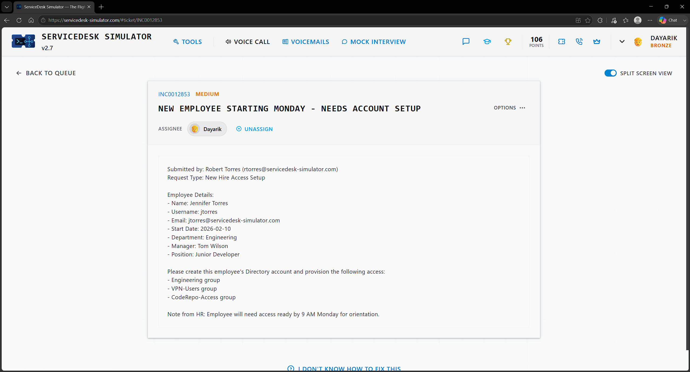
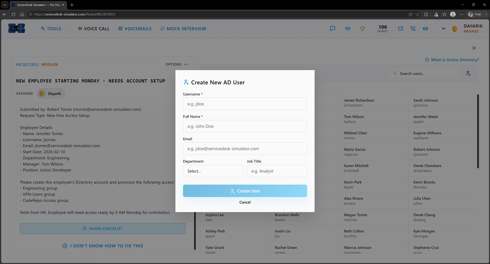
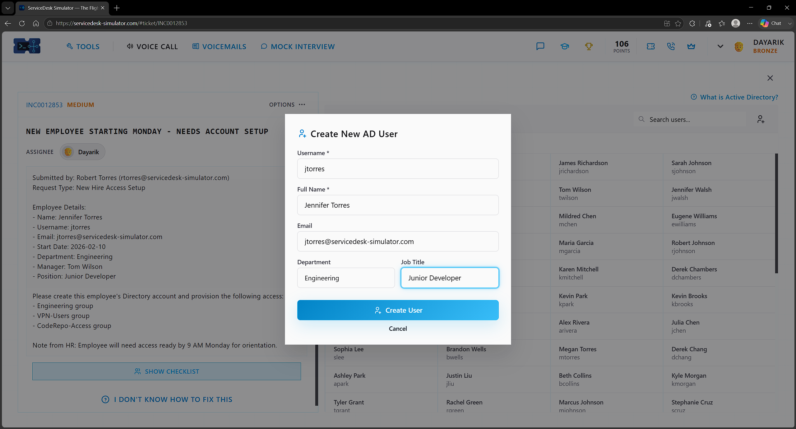
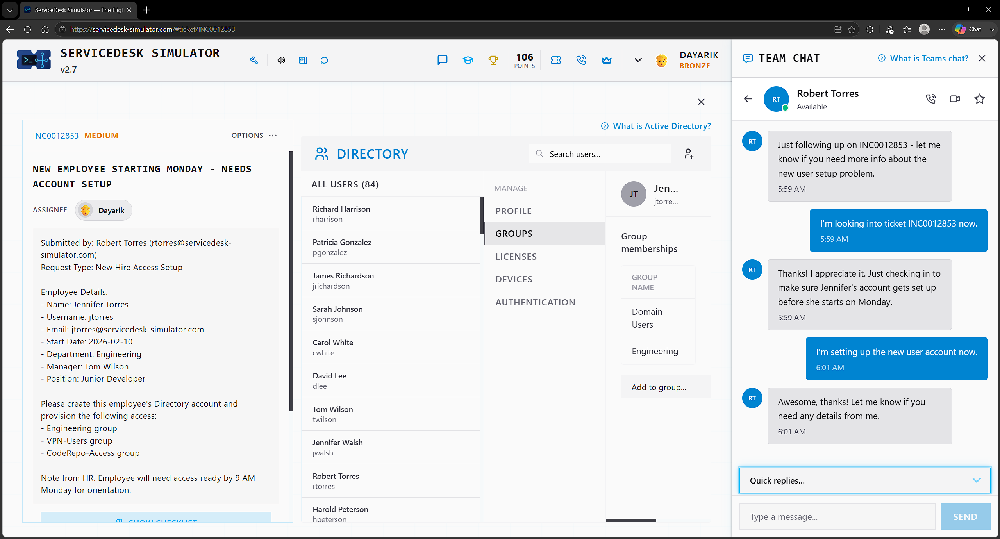
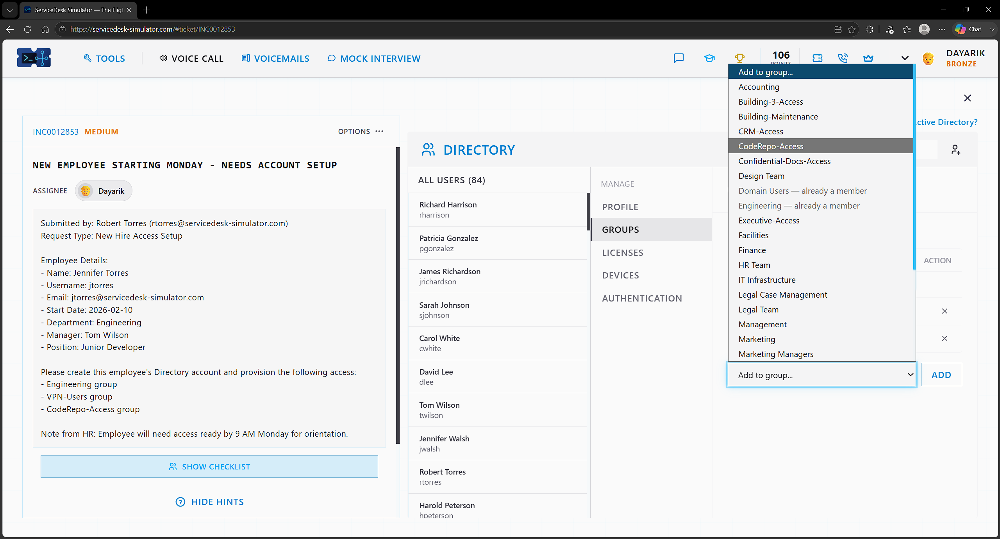
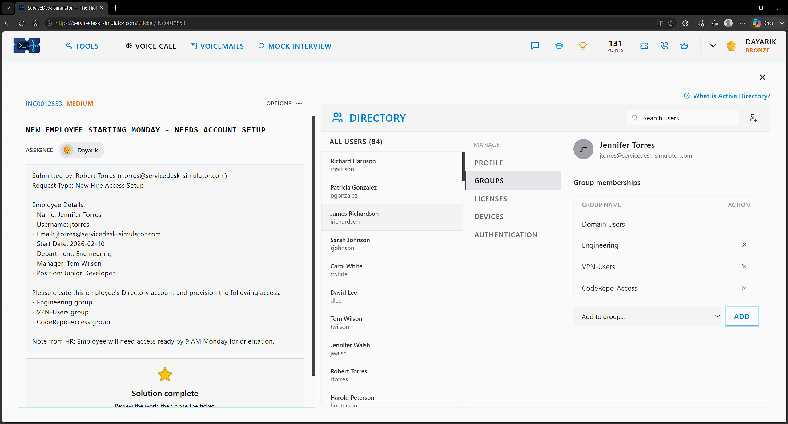

# Ticket 05 — New Employee Starting Monday - Needs Account Setup

**Incident:** INC0012853
**Priority:** Medium
**Submitted by:** Robert Torres
**Request Type:** New Hire Access Setup

---

## Overview

HR wants to add a new employee so they can access the company network when they start on Monday at 9 AM.

---

## Investigation

The employee details were given on the ticket, and I went into Active Directory and added a new user.

---

## Resolution

Using the information from the ticket, I entered the new employee's username, full name, email, department, and job title. After that, I ensured all additional requests were followed by adding them to the groups requested on the ticket and ensuring that the account is secure and accurate before deploying and adding it to Active Directory.

---

## Skills Demonstrated

- Active Directory
- User Account Creation
- New Hire Provisioning
- Group Membership Management
- Access Provisioning

## Technologies Used

- ServiceDesk Simulator
- Active Directory
- Team Chat