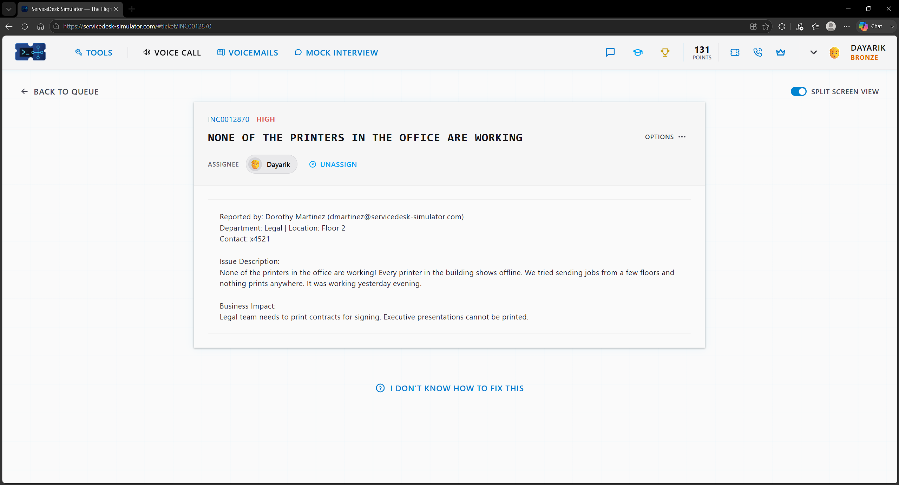
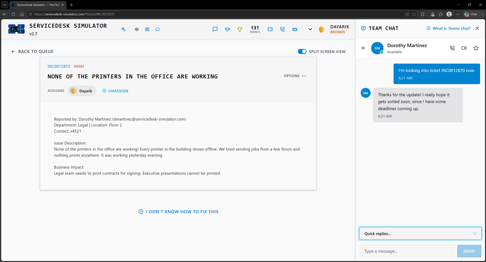
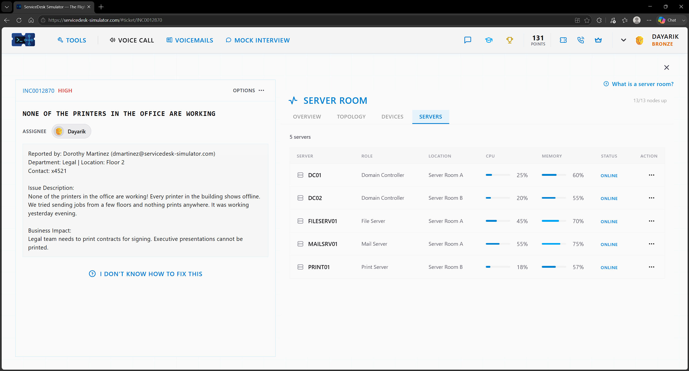
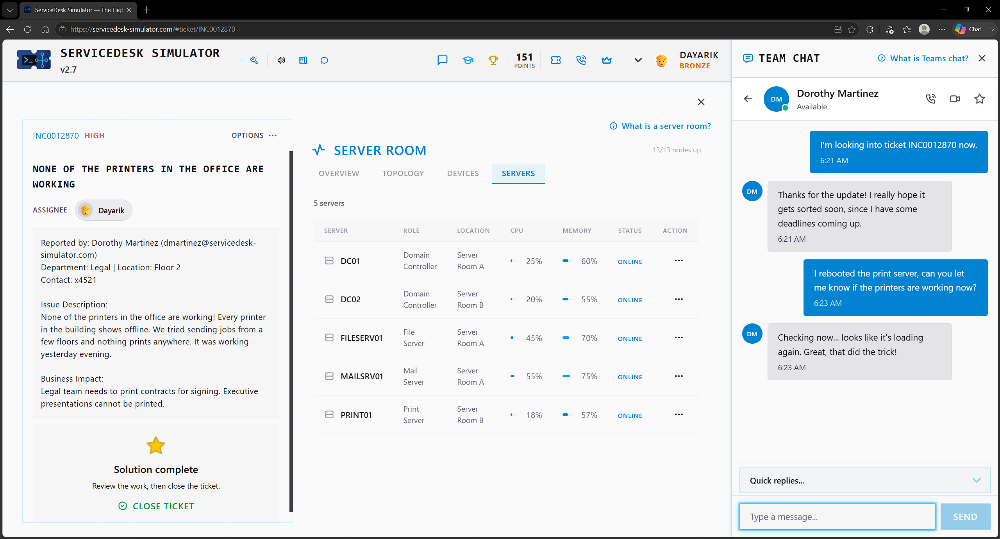

# Ticket 06 — None of the Printers in the Office Are Working

**Incident:** INC0012870
**Priority:** High
**Reported by:** Dorothy Martinez — Legal, Floor 2

---

## Overview

The printers in the entire office was not working, and the legal team needed to print important documents to do their work.

---

## Investigation

I went into the server room and checked the print server, where I found its status was degraded and it was using almost all of its CPU and memory. I also updated the user that I am looking into the ticket.

---

## Resolution

Since no troubleshooting had been performed yet, I restarted the server to see if that would resolve the issue. After the server finished rebooting, the status showed online.

---

## Verification

I verified the issue was resolved by asking the user if the printer was working again, and the user confirmed it was back up and running.

---

## Skills Demonstrated

- Print Server Troubleshooting
- Server Monitoring
- Server Restart
- End User Communication

## Technologies Used

- ServiceDesk Simulator
- Server Room Monitoring
- Print Server
- Team Chat
