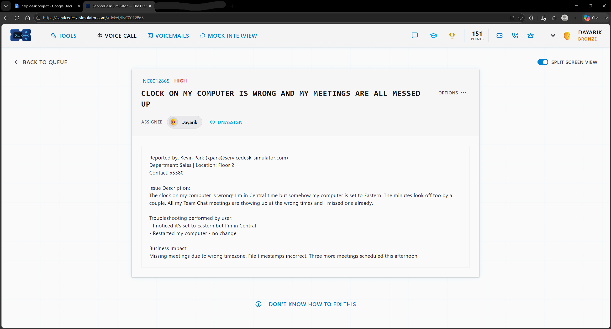
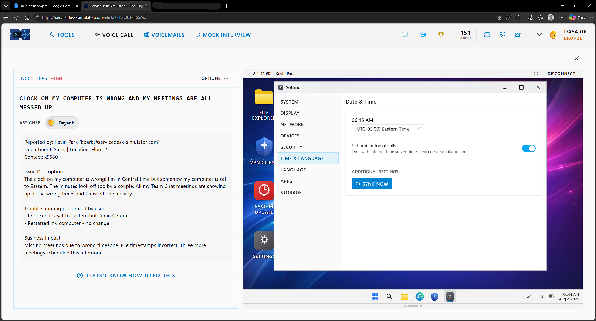
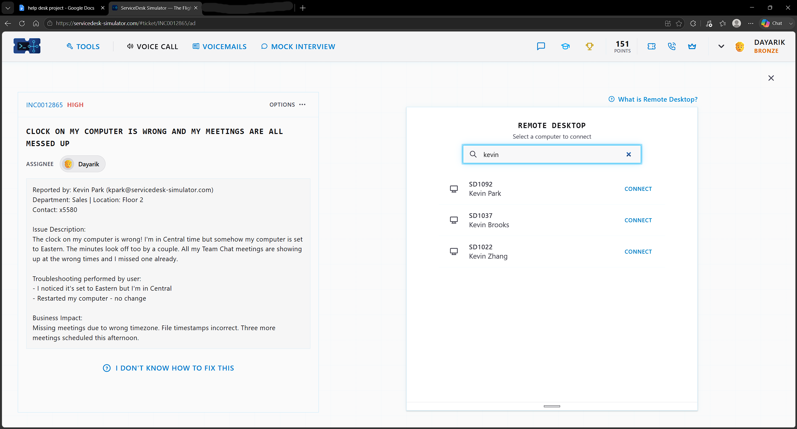
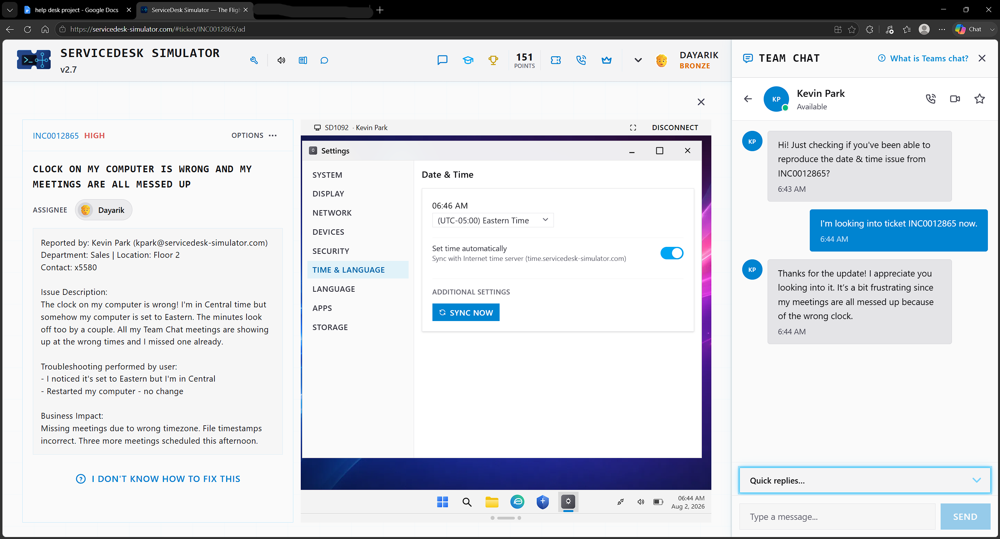
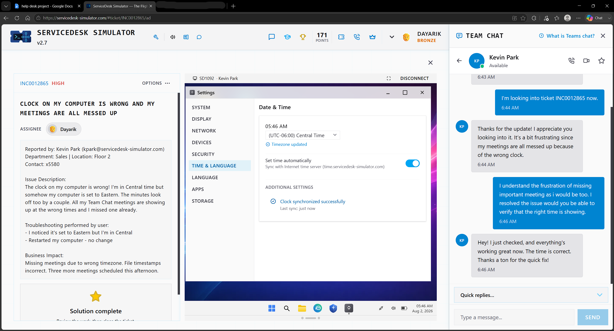

# Ticket 07 — Clock on My Computer Is Wrong and My Meetings Are All Messed Up

**Incident:** INC0012865
**Priority:** High
**Reported by:** Kevin Park — Sales, Floor 2

---

## Overview

The user's clock on their computer was showing the wrong time, causing them to miss an important meeting because of incorrect time zones. The user needs it resolved, as they have three meetings this afternoon and need to ensure that the time is correct so they can be there on time.

---

## Investigation

I reassured the user that I was working on it and first checked whether the user had done any troubleshooting. The user noticed that the time zone was set to Eastern instead of the user's time zone, which is Central. The user also restarted their computer, and no change appeared to happen.

---

## Resolution

With that information, I accessed the user's computer remotely and went into the user's OS settings. From there, I went into date and time, changed the time zone from Eastern time to Central time, and synced their whole computer to match the time.

---

## Verification

After that, I eased the user's frustration as they messaged me saying they were frustrated about missing meetings, and I asked the user to verify if the time was correct. The user said that the time is now correct and the issue was resolved.

---

## Skills Demonstrated

- Remote Desktop Support
- Time Zone Configuration
- Clock Synchronization
- OS Settings Troubleshooting
- End User Communication

## Technologies Used

- ServiceDesk Simulator
- Remote Desktop
- Date & Time Settings
- Team Chat
