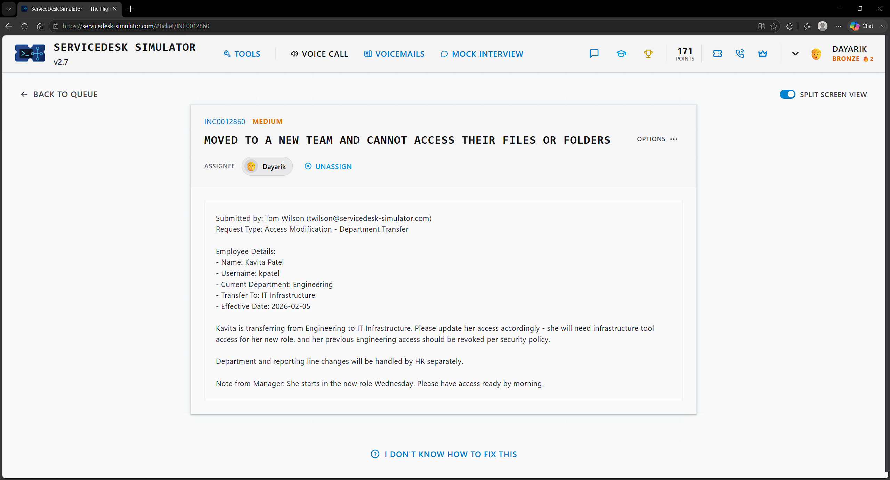
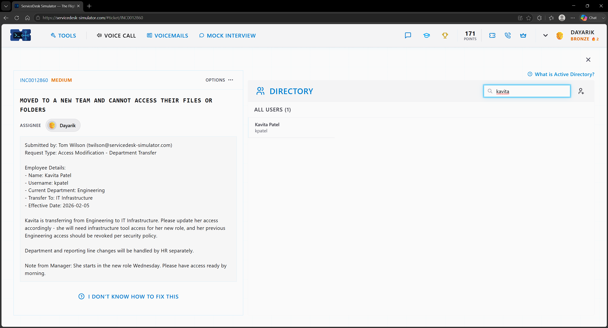
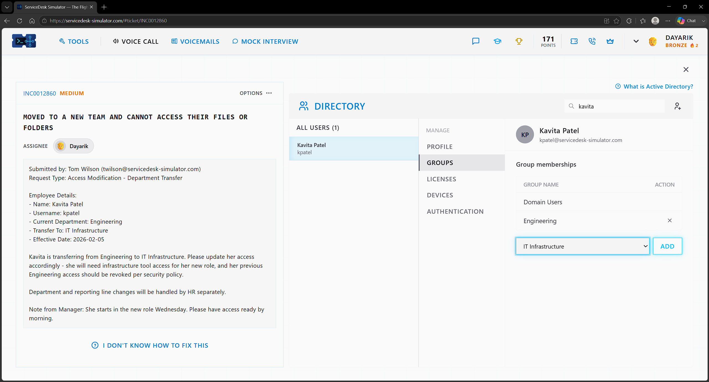
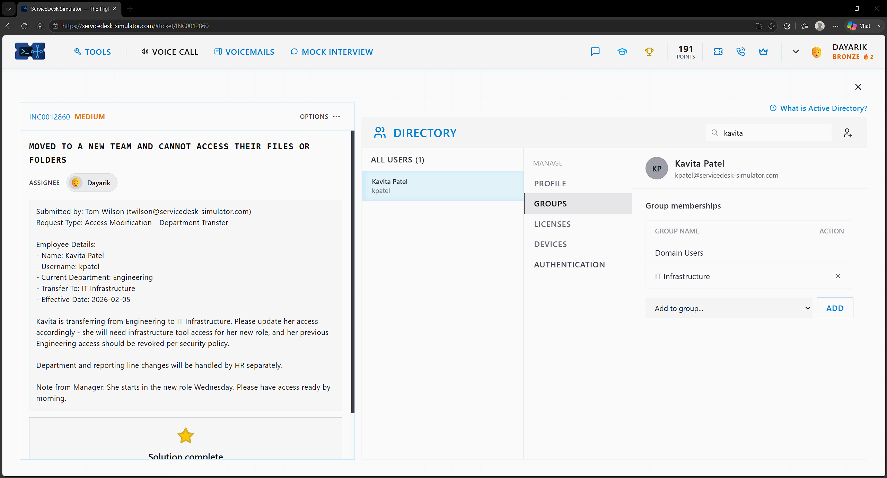
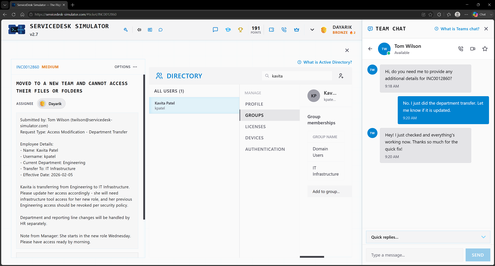

# Ticket 08 — Moved to a New Team and Cannot Access Their Files or Folders

**Incident:** INC0012860
**Priority:** Medium
**Submitted by:** Tom Wilson
**Request Type:** Access Modification - Department Transfer

---

## Overview

A manager requested that an employee have access to a different department because they wanted to do a department transfer. The manager requested that this employee have IT Infrastructure tool access and remove the other department the user is transferring from, which is the Engineering department.

---

## Investigation

I searched for the user given the provided information in the ticket and confirmed that the exisitng group matches the ticket and that all the information provided macthes the user before changing the user's group.

---

## Resolution

After confirming that the current information of the user is correct, I went to groups, added the new IT Infrastructure group, and removed the Engineering group after adding the new group.

---

## Verification

After that, I verified that the information was updated by asking the manager in Team Chat, and the manager confirmed the issue was resolved.

---

## Skills Demonstrated

- Active Directory
- Group Membership Management
- Access Provisioning
- Access Revocation
- Manager Communication

## Technologies Used

- ServiceDesk Simulator
- Active Directory
- Team Chat
