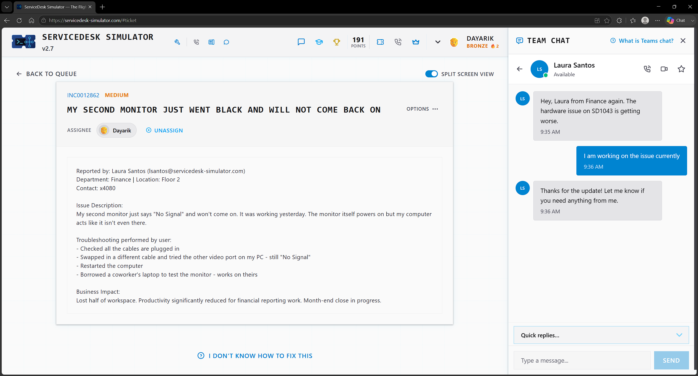
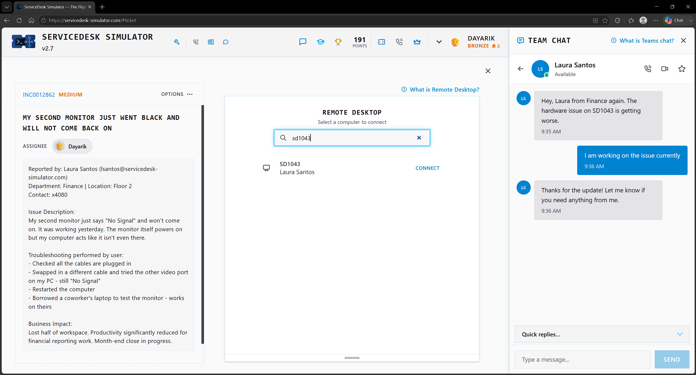
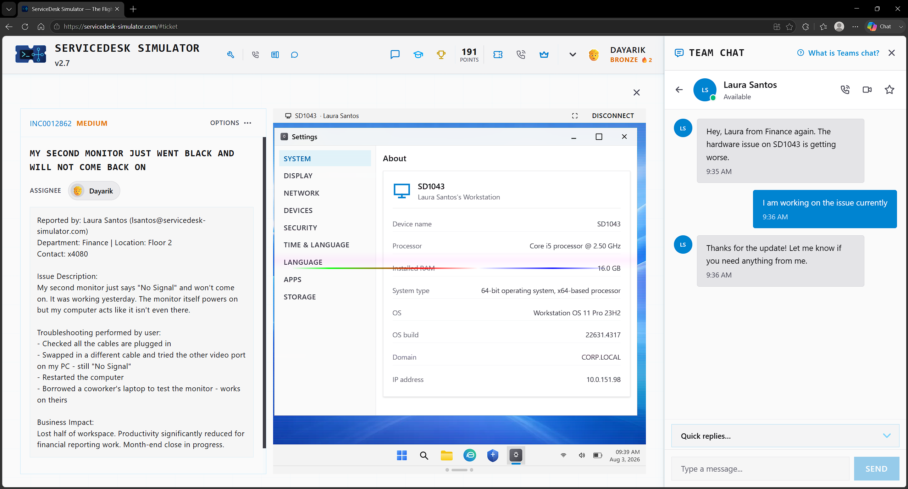
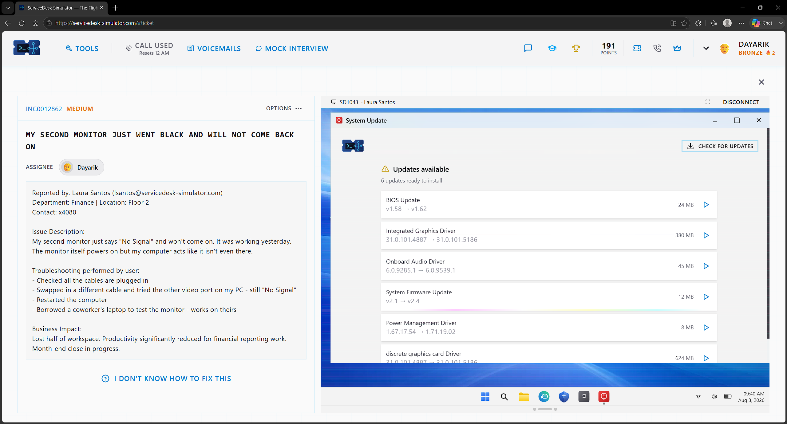
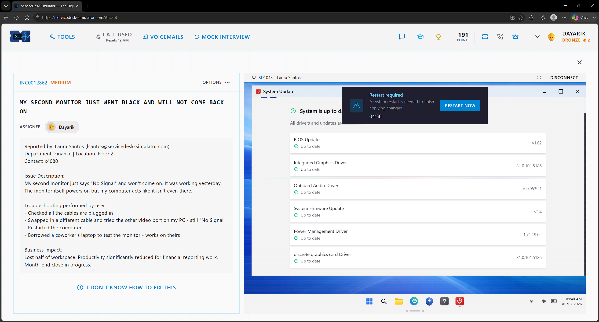
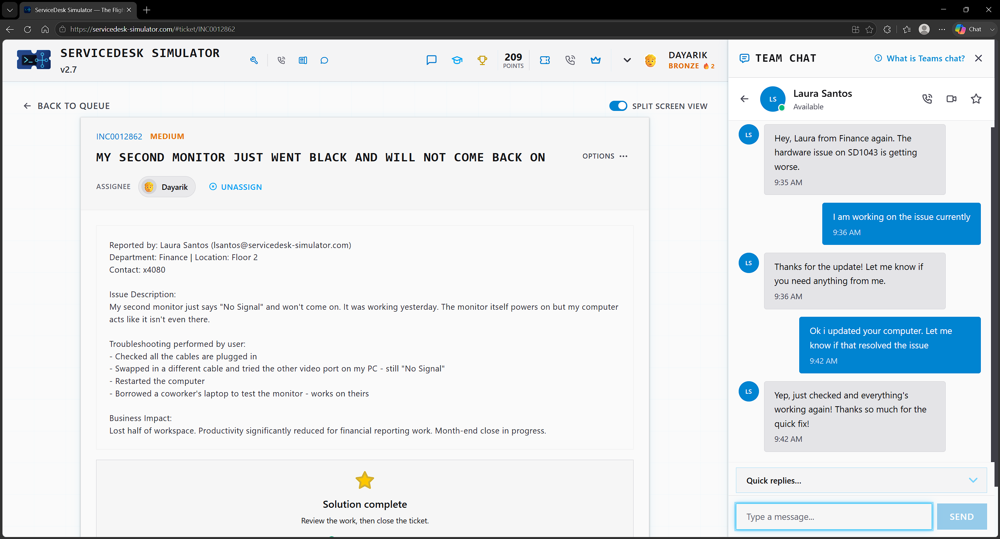

# Ticket 09 — My Second Monitor Just Went Black and Will Not Come Back On

**Incident:** INC0012862
**Priority:** Medium
**Reported by:** Laura Santos — Finance, Floor 2

---

## Overview

The user noticed that the second monitor provides a "No Signal" message on their screen even if everything is plugged in correctly. The user states that the monitor was working the day before and that the monitor powers on but the computer doesn't recognize it.

---

## Investigation

The user troubleshot the issue by checking all the cables to confirm they were properly connected and plugged in, swapping out the cables with different ones, trying another video port on the PC, resetting the PC, and using a different laptop to test the monitor, where the user found out that the monitor works on the other laptop. That rules out multiple troubleshooting steps, so now I am thinking it has something to do with the graphics driver, as everything else works except the video output on the user's PC. I remotely accessed the user's PC to check the system, went to the settings first, and saw nothing out of the ordinary, but noticed that the screen flickers and changes color. I went to System Update, checked for updates, and noticed the user needed 6 updates to be installed, including two graphics driver updates.

---

## Resolution

I updated them promptly and then restarted the computer once they were completed.

---

## Verification

After that, I asked the user if the issue was resolved, and the user confirmed that everything was working.

---

## Skills Demonstrated

- Hardware Troubleshooting
- Display Troubleshooting
- Fault Isolation
- Graphics Driver Updates
- Remote Desktop Support
- End User Communication

## Technologies Used

- ServiceDesk Simulator
- Remote Desktop
- System Settings
- System Update
- Graphics Drivers
- Team Chat