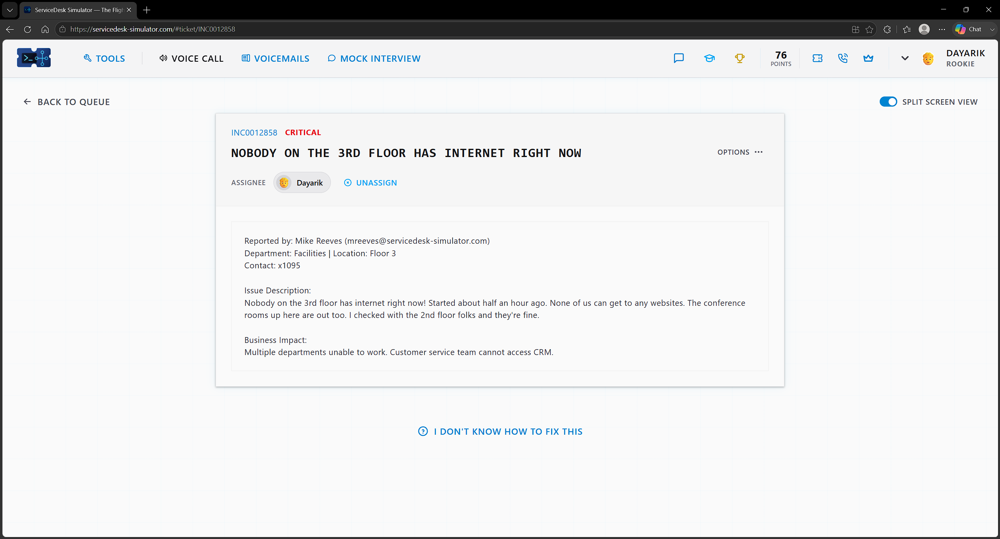
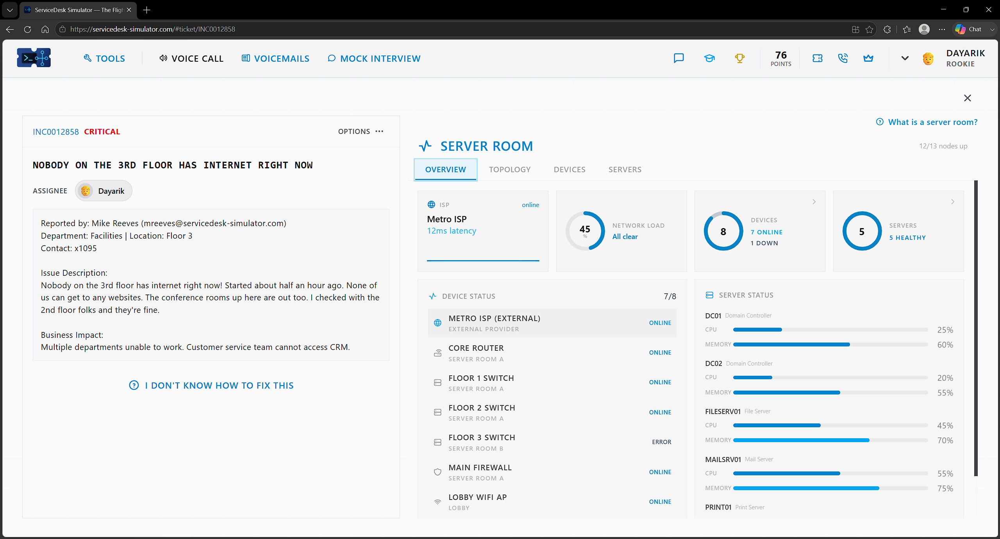
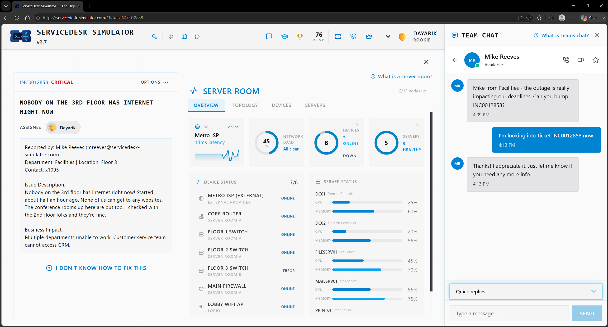
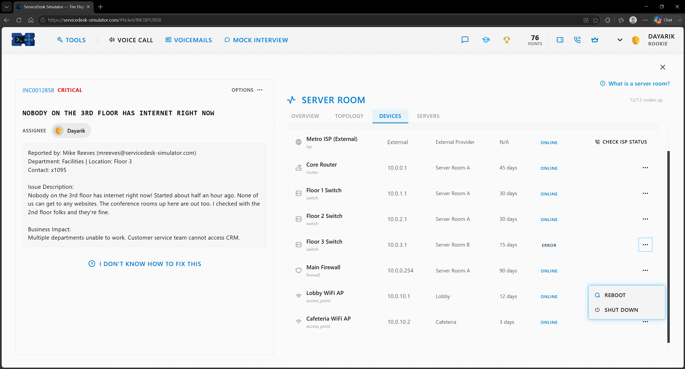
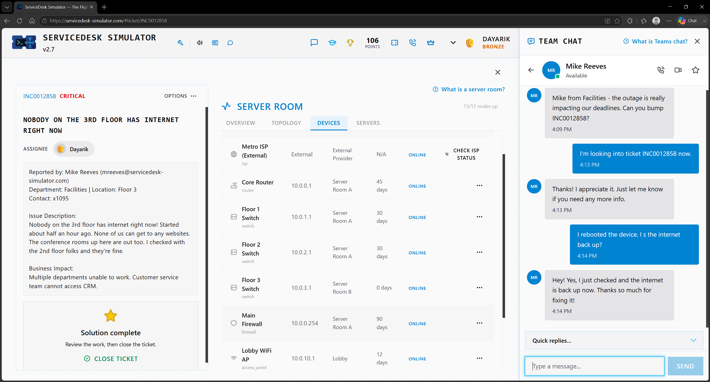

# Ticket 04 — Nobody on the 3rd Floor Has Internet Right Now

**Incident:** INC0012858
**Priority:** Critical
**Reported by:** Mike Reeves — Facilities, Floor 3

---

## Overview

User states an entire floor doesn't have access to the internet currently, making this issue priority number one as they can't do any work and cannot access the CRM.

---

## Investigation

I reassured the user that I am working on the issue as quickly as possible. I notice that the user didn't give any information of them troubleshooting the issue themselves, so I took that into consideration and then went into the server room to check on the devices. 

---

## Resolution

The metrics overview shows me that the Floor 3 switch is down and shows an error, and since the user hasn't tried any troubleshooting yet, I rebooted the device to see if that would resolve the issue, as that is the easiest resolution to start with.

---

## Verification

After rebooting and waiting 30 seconds to 1 minute for it to fully reboot, the device now says it is online, and I verified that the internet was back up by asking the user in Team Chat. The user verified that everything is back up, verifying that the issue was resolved.

---

## Skills Demonstrated

- Network Troubleshooting
- Incident Prioritization
- Network Device Monitoring
- Network Device Reboot
- End User Communication

## Technologies Used

- ServiceDesk Simulator
- Server Room Monitoring
- Network Switch
- Team Chat
