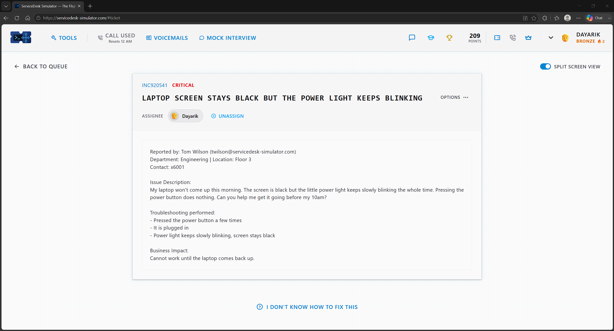
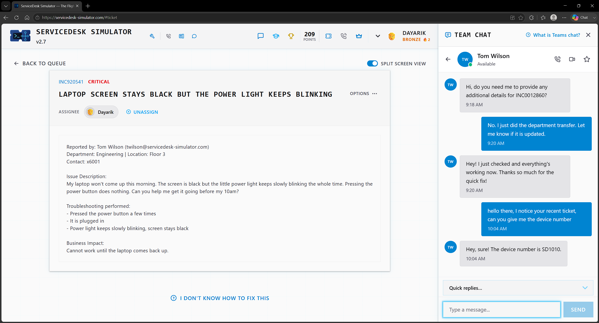
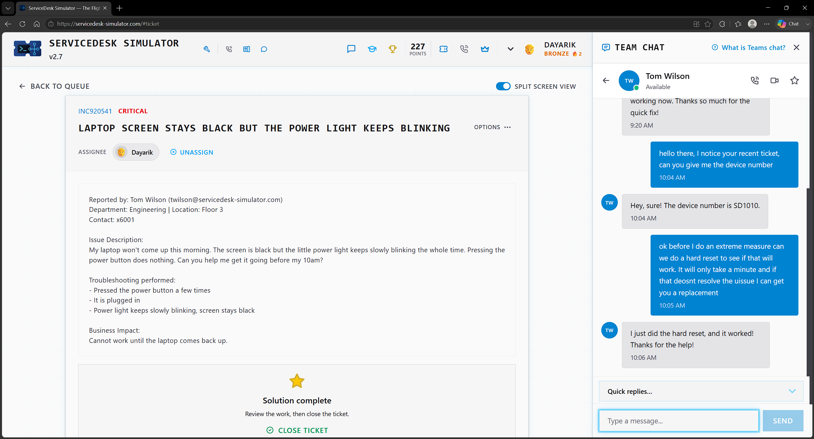

# Ticket 10 — Laptop Screen Stays Black but the Power Light Keeps Blinking

**Incident:** INC920541
**Priority:** Critical
**Reported by:** Tom Wilson — Engineering, Floor 3

---

## Overview

The user's laptop won't turn on, but the power light is blinking.

---

## Investigation

The user did some troubleshooting by pressing the power button a few times and plugging it into the charger. That didn't resolve the issue, so at first I asked the user for the device number so I could get a replacement ready for them, but before I took that step, I noticed the user hadn't done a hard reset on the laptop.

---

## Resolution

I then asked the user to perform a hard reset to see if that would work and told the user that if it didn't work, we would get a replacement, as the user needs the laptop to work for the business, making the issue critical.

---

## Verification

The user confirmed that the hard reset worked, resolving the issue.

---

## Skills Demonstrated

- Hardware Troubleshooting
- Guided Troubleshooting
- Laptop Hard Reset
- Incident Prioritization
- End User Communication

## Technologies Used

- ServiceDesk Simulator
- Team Chat
